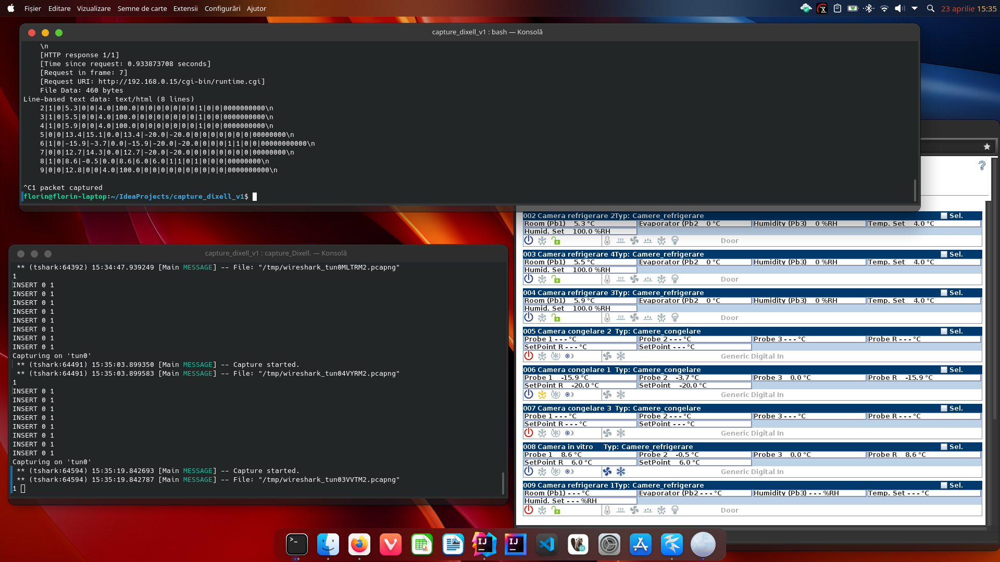
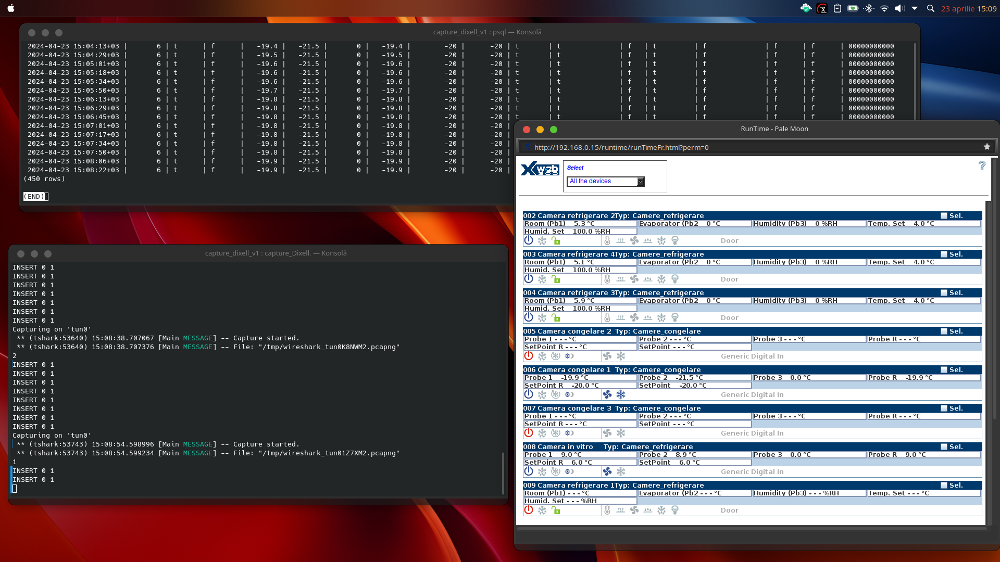

# Capture data send by Dixell XWEB300D
Because I have necessary to save parameters readings by Dixell XWEB300D, it's a monitoring and control device for Dixell controllers
like XC60CX or/and XL260L, into time series database TimescaleDB I used a technique named sniffing to capture the
packages between the client and the server.  
Http server is running into Dixell XWEB300D devices. In menu application we have a runtime pages where we add all devices
monitoring and controlled by XWEB300D.  
First we start runtime page from server using web browser (client) and then we capture the packages arrived into our network 
interface. After that we start in console the sniffer tshark (is necessary to be installed before, with command
```sudo apt install tshark``` for ubuntu systems) with command:  
```shell
tshark -V -i tun0 -Y "ip.addr==192.168.0.15 and http.response.line" -F k12text
```
in my case the interface is tun0 because I used a vpn connection and 192.168.0.15 is ip address for XWEB300D device 
where is run https server. For easy readings we leave to run only the page with runtime from XWEB300D device in browser.  
The tshark command is filtered for our ip, and only we catch response line, after that the output is formated for k12text (text).  
Because the runtime pages send request at every approximate 15 seconds to fill the form we after this time catch the lines 
needed:  
```text
...
    [Request URI: http://192.168.0.15/cgi-bin/runtime.cgi]
    File Data: 460 bytes
line-based text data: text/html (8 lines)
    2|1|0|5.3|0|0|4.0|100.0|0|0|0|0|0|0|0|1|0|0|0000000000\n
    3|1|0|5.5|0|0|4.0|100.0|0|0|0|0|0|0|0|1|0|0|0000000000\n
    4|1|0|5.9|0|0|4.0|100.0|0|0|0|0|0|0|0|1|0|0|0000000000\n
    5|0|0|13.4|15.1|0.0|13.4|-20.0|-20.0|0|0|0|0|0|0|0|00000000\n
    6|1|0|-15.9|-3.7|0.0|-15.9|-20.0|-20.0|0|0|0|1|1|0|0|00000000000\n
    7|0|0|12.7|14.3|0.0|12.7|-20.0|-20.0|0|0|0|0|0|0|0|00000000\n
    8|1|0|8.6|-0.5|0.0|8.6|6.0|6.0|1|1|0|1|0|0|0|00000000\n
    9|0|0|12.8|0|0|4.0|100.0|0|0|0|0|0|0|0|0|0|0|0000000000\n
...
```
this lines we need to construct our sql insert command to our TimescaleDB database.  



Later we used this database in TimescaleDB (extension under PostgreSQL) where we needed, me I used into Grafana server.  

>**Warning**  
> The script work only if the page where is sent the request exist and the web browser page is not closed  
  

  

In version 2 I'm using curl to send only the command necessary, this also was obtained using tshark sniffer, and to get the answer.  
This is more elegant solution.  


